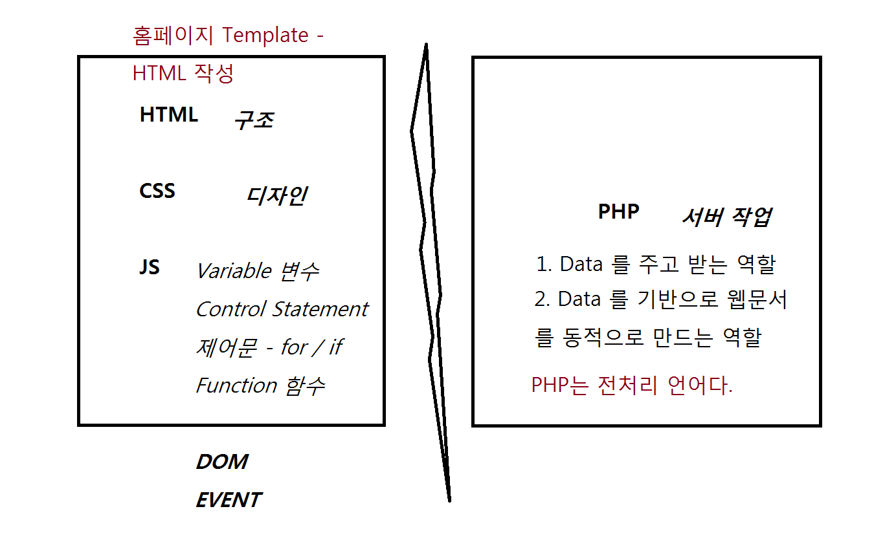

# 프로그래밍 방법론

## 절차지향

절차지향 프로그래밍이란 무엇일까요?

절차지향 프로그래밍이란, 객체지향 프로그래밍과는 달리 <b>프로시져(Procedure)</b> 라는 것을 중심으로, 프로시져의 입력과 리턴이 다른 프로시져에게 영향을 미쳐 프로그램이 진행되도록 코딩하는 방법을 얘기해요. '프로시져' 라는 게 뭔지 설명하기 전에는 당연히 절차지향 프로그래밍도 설명할 방법이 없어서, 간단한 예를 들어볼게요!

절차지향적으로 <b>커피를 주문받으면 그 커피를 만드는 프로그램</b> 을 설계해볼게요!

1. 커피를 주문하는 <b>프로시져</b>를 설계합니다!
2. 커피를 주문하는 프로시져는 커피의 종류와 커피의 사이즈를 <b>입력</b>해야합니다.
3. 커피를 주문하는 프로시져는 커피의 종류와 커피의 사이즈에 따라 필요한 재료를 <b>리턴</b>합니다.
4. 커피를 만드는 <b>프로시져</b>를 설계합니다!
5. 커피를 만드는 프로시져는 재료들을 <b>입력</b>해야합니다.
6. 커피를 만드는 프로시져는 재료들을 이용해 커피를 만들어 <b>리턴</b>합니다.
7. 커피를 주문하는 프로시져를 실행하고, 그 결과를 다시 커피를 만드는 프로시져에 반영하여 실행합니다. 커피를 만드는 프로시져의 결과로 커피를 만들어냅니다!

조금 프로시져와 절차지향적 프로그래밍이 뜻하는 바가 감이 잡히시나요? <br/>
절차지향 프로그래밍은, <b>프로그램에 사용될 작업들을 구현해두고, 그 작업을 서로 엮어 진행하도록 프로그래밍하는 방법</b>을 의미합니다!

## 객체지향

객체지향 프로그래밍이란 무엇일까요?

객체지향 프로그래밍이란, 절차지향 프로그래밍과는 달리 <b>객체(Object)</b> 라는 것을 중심으로 프로그램이 진행되도록 코딩하는 방법을 얘기해요. '객체' 라는 게 뭔지 설명하기 전에는 당연히 객체지향 프로그래밍도 설명할 방법이 없어서, 간단한 예를 들어볼게요!

객체지향적으로 <b>커피를 주문받으면 그 커피를 만드는 프로그램</b> 을 설계해볼게요!

1. 커피머신 이라는 <b>객체</b>를 만듭니다!
2. 커피머신 객체 안에는, 주문된 커피의 종류가 뭔지 저장하는 <b>공간</b>과, 커피의 사이즈가 뭔지 저장하는 <b>공간</b>이 있습니다.
3. 커피머신 객체 안에는, 주문된 커피의 종류와 사이즈에 따라 에스프레소와 기타 재료를 혼합하여 커피를 만들어 돌려주는 <b>기능</b>이 있습니다.
4. 사람 이라는 <b>객체</b>를 만듭니다!
5. 사람 객체 안에는, 커피머신에게 주문할 커피의 종류와 사이즈를 결정해 커피를 주문하는 <b>기능</b>이 있습니다.
6. 사람 객체의 커피 주문 기능을 이용해, 커피머신에게 커피를 만들어달라고 요청하면 커피머신은 커피를 만들어 돌려주는 기능을 통해 커피를 만들어냅니다!

조금 객체와 객체지향적 프로그래밍이 뜻하는 바가 감이 잡히시나요? <br/>
객체지향 프로그래밍은, <b>프로그램에 사용될 대상의 특징과 속성에 대해 파악하여 소스코드로 구현해둔 객체를 이용하여 원하는 작업을 진행하도록 프로그래밍하는 방법</b>을 의미합니다!

# 프로그래밍 환경

## CLI, Command Line Interface

Console 과 같이 시스템의 리소스를 많이 차지하지 않으며 원하는 작업을 효율적으로 수행하는 환경.
- 각 언어의 문법을 배우기에 용이

## GUI, Graphic User Interface

Graphic 적 요소를 통해 사용자가 프로그램을 쉽게 사용할 수 있도록 설계하는 환경.
- 서비스를 실제로 제공하기에 용이


# Web 에서의 각 언어가 하는 역할

<br/>


<hr/>

# JS

JS 는 사용자의 Input 에 따라 발생하는 Event에 대해 동적으로 변화를 주는 역할을 합니다.

1. 사용자의 Input이 들어옴.
2. EVENT가 일어난것을 감지한다. (Listener)
3. 해야할일 한다.

개발할 때에는 위의 과정을 역순으로 진행하는 경우가 많다.

1. 해야할일을 정의한다. (function)
2. Event Listener를 정의하고 추가한다. (addEventlistener)
3. Input을 통해 테스트한다.

## Function

정의
```
function FUNCTION_NAME ( parameters ){
    //TODO
    return RESULT
}
```

호출
```
FUNCTION_NAME();
```

#### Method
Object 내부에 정의된 Function 으로, 해당 Object를 통하지 않으면 사용할 수 없는 Function.

예>
```
document.getElementById();
console.log();
```

## Listener

정의
```
HTML_ELEMENT_OBJECT.addEventListener('EVENT_NAME', FUNCTION_NAME);
```
또는
```
HTML_ELEMENT_OBJECT.addEventListener('EVENT_NAME', function(e){
    //TODO
});
```

