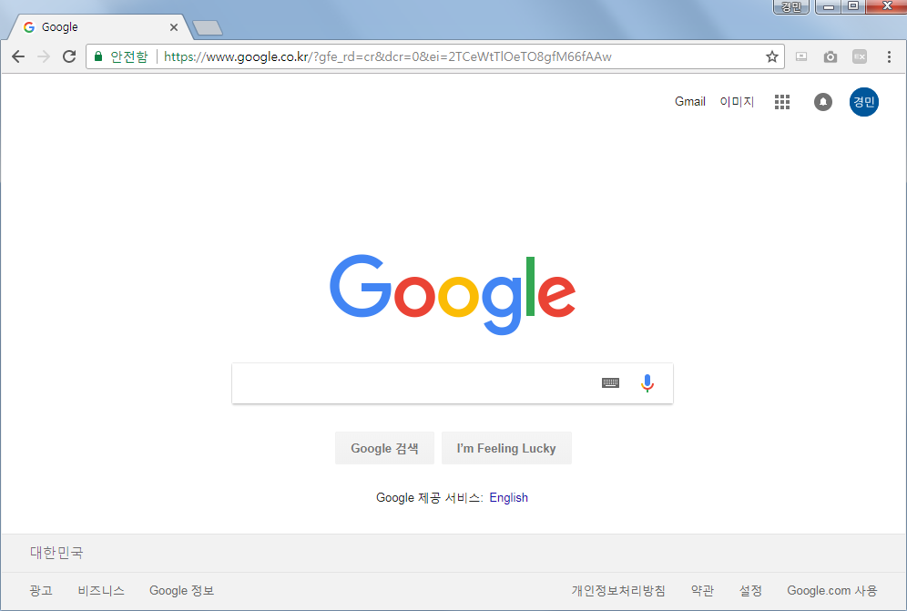

# Web Development Class

Web 과 Server 에 대한 이해를 위한 수업입니다.

HTML, javascript, css 와 같은 Front-end 와 
php, SQL 과 같은 Back-end 에 대해 배울 수 있습니다.

## Getting Started

Server 와 Client 란 무엇일까요?

[출처] https://stackoverflow.com/questions/13121531/multi-client-server-common-way-for-2-way-connection-in

위의 그림에서 볼 수 있듯이, Client 란 Server에게 <b>요청(Request)</b>을 보내고 <b>응답(Response)</b>을 받는 역할입니다.
반대로 Server란 Client로부터 요청을 받아 응답을 보내는 역할입니다.

그렇다면 Client와 Server는 위의 그림처럼 서로 다르게 생겼을까요?

아닙니다. Client 와 Server는 둘 모두 똑같이 생긴 컴퓨터입니다. 다만 Client와는 다르게 <b>Server는 언제든 Client로부터 요청을 받을 수 있도록
대기중인 컴퓨터</b>인 것이죠. 일반적인 노트북도 언제든지 Server가 되도록 설정할 수 있습니다.

그렇다면 Client와 Server가 하는 일은 뭘까요?

## Client & Server

### Client

먼저 Client는 Server에게 요청을 보내고 응답을 받는 역할이라고 했는데, 과연 어떤 종류의 요청을 보내고 어떤 응답을 받을까요?

Client의 입장에서 요청의 대표적인 예가 바로 홈페이지 접속입니다.

<b>한번 Google 홈페이지에 접속해볼까요?</b>

먼저 각자 사용하시는 웹브라우져 (Edge, Chrome, Safari, Firefox...)를 실행한 후,

 

상단의 주소창에 www.google.com 이라고 입력하고 잠시 기다리면,

 

google 홈페이지가 나타나죠!

 

<b>사실 이 과정에서 이미 우리는 요청을 보내고 응답을 받았습니다.</b>
우리는 google 서버에게 google 메인 홈페이지가 어떻게 생겼는지 알려달라고 요청을 보냈고, 그래서 어떻게 생겼는지가 담겨있는 정보를 응답으로 받았죠.

이를 통해 몇가지 정리할 수 있는 것들이 있습니다.

1. Browser 는 그 사이에서 주소창에 입력하는 것만으로 요청을 보내주는 역할을 합니다.
2. Browser 는 응답으로 받은 정보를 통해 어떻게 생겼는지 우리에게 보여주는 역할도 합니다.
3. Browser 는 위의 요청과 응답을 쉽게 사용할 수 있도록 도와줄 뿐이기 때문에,  Browser 없이도 Server 에게 요청을 보내고 응답을 받을 수 있습니다.
4. Server 에게 홈페이지가 어떻게 생겼는지 알려달라는 요청 외에도 다른 요청을 보낼 수 있습니다.

Client 가 하는 역할에 대해 조금 감이 잡히셨나요?

앞으로 수업을 통해 <b>'홈페이지가 어떻게 생겼는지를 담는 정보'</b> 란 무엇인지, 홈페이지 접속 외에도 어떤 <b>다양한 요청과 응답</b> 이 있을지 배울거에요 :D 

(스포일러를 하자면, 홈페이지가 어떻게 생겼는지를 담는 정보가 바로 유명한 <b>HTML</b> 이에요!)
   

### Server

그럼 서버가 하는 일을 살펴볼까요? 위에서 Client는 여러 종류의 요청을 보낼 수 있다고 한걸로 유추하건데, Server가 하는 일은 Client의 요청에 따라 달라요!

홈페이지가 어떻게 생겼는지 알려주는 것 외의 Server의 대표적인 역할이 바로 검색입니다.

<b>한번 Google 에 "Client and Server" 라고 검색해볼까요?</b>

google 검색창에 Client and Server 라고 입력하고 잠시 기다리면,

 

검색결과가 나타나죠!

이 과정에서 검색할 검색어와 함께 검색해달라고 Client가 요청을 했고,  <b>Server는 검색해달라는 요청과 검색어를 받아서 일치하는 정보들을 응답으로 보내줬네요!</b>

이걸 통해 또 몇가지 정리할 수 있는 사실들이 있습니다.

1. Server 는 Client 로부터 요청과 함께 데이터를 받을 수 있습니다.
2. Server 는 많은 정보가 저장된 곳으로부터 일부 정보를 가져올 수 있습니다.
3. Server 는 Client 가 보낸 요청에 따라 서로 다른 작업을 하지만, Client 입장에서는 그 과정을 눈으로 볼 수 없습니다.

Server의 역할도 조금 감이 잡히셨나요?

Server는 Client와는 달리 과정을 눈으로 볼 수 없어서 감이 조금 덜 잡힐수도 있어요. 그래서 Server를 더 어렵게 여기는 경우가 많아요! 
실제로 Client와 Server를 눈에 보이는 부분과 보이지 않는 부분이라는 의미에서 <b>Front-end</b> 와 <b>Back-end</b> 라고 표현하기도 합니다!

[출처]https://comic.browserling.com/

역시 앞으로 수업을 통해 <b>'많은 정보가 저장된 곳'</b> 이란 무엇인지, <b>다양한 요청과 데이터를 어떻게 처리해서 어떻게 응답할지</b> 에 대해 배울거에요 :D 

(두번째 스포일러를 하자면, 많은 정보가 저장된 곳이 바로 <b>Database, DB</b> 에요!)

### [Day1 - HTML](Day1.md)
